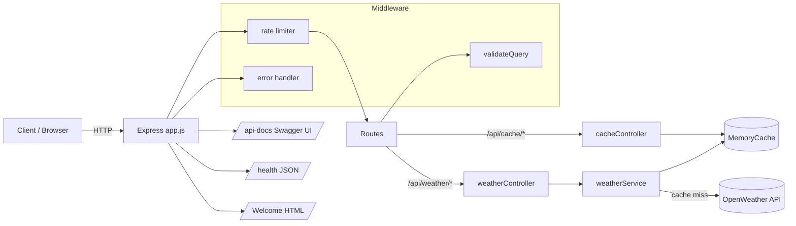

# Weather Proxy API — Step-by-Step Build Guide

> **Archived: original build playbook.** This document is the original roadmap used to build the Weather Proxy API from an empty folder to a deployable service. It is intentionally self-contained so it can be replayed step by step. The codebase may have evolved since this guide was written; for the current setup, architecture, and deployment notes, always defer to [../README.md](../README.md).

---

> **Project Summary:** Weather Proxy API is a production-minded Node.js/Express backend that proxies the OpenWeather API while keeping the upstream `OPENWEATHER_API_KEY` hidden from clients. It adds an in-memory TTL cache to cut latency and upstream calls, per-IP rate limiting to curb abuse, strict query validation for `city`/`lat`/`lon`, response filtering so clients receive only the fields they need, and interactive Swagger documentation. The architecture is cleanly layered (routes → middlewares → controllers → services → utils), the app is decoupled from the HTTP listener for testability, and the suite is covered by Jest + Supertest.

Each step below is a self-contained prompt. Execute them in order.

Stack: Node.js, Express 5, Axios, dotenv, Helmet, CORS, express-rate-limit, swagger-jsdoc, swagger-ui-express, Jest, Supertest.

---

## Table of Contents

**PHASE 1 — Backend Foundation**

- STEP 1 — Project Scaffolding & Dependency Setup
- STEP 2 — Environment Configuration Layer
- STEP 3 — Error Primitives (ApiError + Error Handler)
- STEP 4 — In-Memory TTL Cache Utility

**PHASE 2 — Backend Resources**

- STEP 5 — Weather Service (OpenWeather Proxy, Filtering, Caching)
- STEP 6 — Controllers (Weather + Cache)
- STEP 7 — Validation & Rate-Limiting Middlewares
- STEP 8 — Routes with Swagger Annotations

**PHASE 3 — App Assembly & Documentation**

- STEP 9 — Swagger Specification
- STEP 10 — Application Wiring (app.js) + Health + Welcome Page
- STEP 11 — Server Bootstrap (server.js)

**PHASE 4 — Testing**

- STEP 12 — Jest Configuration
- STEP 13 — Unit & Integration Test Suite

**PHASE 5 — Polish & Deploy**

- STEP 14 — Environment & Ignore Files
- STEP 15 — Deployment (Render) & Community Docs
- STEP 16 — README & Final Verification

**Appendices**

- Appendix A — Shared Constants (Environment Variables)
- Appendix B — Canonical Response Shapes
- Appendix C — Common Pitfalls
- Appendix D — Pre-Flight Checklist

---

## Global Build Rules (apply to EVERY step)

- **No git operations.** Do not run `git` commands, do not commit, and do not push. Version control is handled manually by the user.
- Do not install unapproved packages. Only add the dependencies named in a step.
- Do not run long-running processes (dev servers, watchers) unless the step explicitly asks for it.
- Treat every step as self-contained: it states its goal, the files it touches, and how to verify it.
- Keep code clean, readable, and modern (ES6+, `async/await`). Prefer native methods over new dependencies.
- Favor camelCase, English identifiers, and the DRY principle. Comment only non-obvious intent.
- Prioritize security (hidden API key, safe headers), validation, and performance (caching) at every layer.

---

## Architecture at a Glance



Request flow: a client calls `/api/weather/*`; the rate limiter checks the per-IP window; validation middleware normalizes inputs; the controller delegates to the service; the service returns cached data on a hit, otherwise calls OpenWeather, filters the payload, caches it, and returns it. All errors funnel into a single centralized error handler.

---

# PHASE 1 — BACKEND FOUNDATION

---

## STEP 1 — Project Scaffolding & Dependency Setup

**Goal:** Initialize the Node.js project and install runtime + dev dependencies.

**Files/folders to create:**

- `package.json`
- `src/` (source root)

**Dependencies:**

```bash
npm init -y
npm install axios cors dotenv express express-rate-limit helmet swagger-jsdoc swagger-ui-express
npm install --save-dev nodemon jest supertest
```

**Implementation notes:**

- Set `"main": "src/server.js"`.
- Add scripts:

```json
{
  "scripts": {
    "start": "node src/server.js",
    "dev": "nodemon src/server.js",
    "test": "jest --runInBand",
    "test:watch": "jest --watch"
  }
}
```

- Set `"license": "MIT"` and fill in author metadata.

**Acceptance:** `npm install` completes; `package.json` lists all dependencies and the four scripts.

---

## STEP 2 — Environment Configuration Layer

**Goal:** Centralize all runtime configuration behind a single module so the rest of the code never reads `process.env` directly.

**Files to create:**

- `src/config/index.js`

**Implementation notes:**

- Load `dotenv` at the top, then export a typed-ish config object with safe fallbacks.

```javascript
const dotenv = require("dotenv");
dotenv.config();

const config = {
  port: parseInt(process.env.PORT, 10) || 3000,
  openWeather: {
    apiKey: process.env.OPENWEATHER_API_KEY,
    baseUrl: "https://api.openweathermap.org/data/2.5",
  },
  cache: {
    ttl: parseInt(process.env.CACHE_TTL, 10) || 600,
  },
  rateLimit: {
    windowMs: parseInt(process.env.RATE_LIMIT_WINDOW_MS, 10) || 15 * 60 * 1000,
    max: parseInt(process.env.RATE_LIMIT_MAX, 10) || 100,
  },
};

module.exports = config;
```

**Security:** The API key only ever lives in this server-side config; it is never sent to clients.

**Acceptance:** `require("./src/config")` returns an object with `port`, `openWeather`, `cache`, and `rateLimit`.

---

## STEP 3 — Error Primitives (ApiError + Error Handler)

**Goal:** Provide a single error type and one centralized Express error handler so every layer reports failures consistently.

**Files to create:**

- `src/utils/ApiError.js`
- `src/middlewares/errorHandler.js`

**Implementation notes:**

```javascript
// src/utils/ApiError.js
class ApiError extends Error {
  constructor(statusCode, message) {
    super(message);
    this.statusCode = statusCode;
    this.name = "ApiError";
  }
}

module.exports = ApiError;
```

```javascript
// src/middlewares/errorHandler.js
const ApiError = require("../utils/ApiError");

const errorHandler = (err, _req, res, _next) => {
  if (err instanceof ApiError) {
    return res.status(err.statusCode).json({ success: false, error: err.message });
  }
  console.error("Unhandled error:", err);
  return res.status(500).json({ success: false, error: "Internal server error" });
};

module.exports = errorHandler;
```

**Notes:** Keep the four-argument signature so Express recognizes it as error middleware. Unknown errors are logged server-side but never leak internals to the client.

**Acceptance:** Throwing `new ApiError(400, "bad")` from a route yields `{ success: false, error: "bad" }` with HTTP 400.

---

## STEP 4 — In-Memory TTL Cache Utility

**Goal:** A dependency-free TTL cache with stats, manual flush, and a background sweeper for expired keys.

**Files to create:**

- `src/utils/cache.js`

**Implementation notes:**

- Back the store with a `Map`. Store `{ data, expiresAt }`.
- Lazy-expire on `get`, and additionally run a periodic `cleanup()` so unread keys do not linger.
- `unref()` the sweeper timer so it never keeps the process (or the test runner) alive.
- Export a singleton instance, but also export the class for unit tests.

```javascript
const config = require("../config");

class MemoryCache {
  constructor(ttl = config.cache.ttl, cleanupIntervalMs) {
    this.store = new Map();
    this.ttl = ttl * 1000;
    const interval =
      cleanupIntervalMs === undefined ? Math.max(this.ttl, 60 * 1000) : cleanupIntervalMs;
    if (interval > 0) {
      this.cleanupTimer = setInterval(() => this.cleanup(), interval);
      if (typeof this.cleanupTimer.unref === "function") this.cleanupTimer.unref();
    }
  }
  // get / set / flush / cleanup / getStats / stopCleanup ...
}

module.exports = new MemoryCache();
module.exports.MemoryCache = MemoryCache;
```

**Performance:** TTL caching is the primary lever for reducing upstream OpenWeather calls and latency.

**Acceptance:** `set` then `get` returns the value before TTL; after TTL it returns `null`; `getStats()` reports `activeKeys`, `expiredKeys`, `totalKeys`.

---

# PHASE 2 — BACKEND RESOURCES

---

## STEP 5 — Weather Service (OpenWeather Proxy, Filtering, Caching)

**Goal:** Encapsulate all OpenWeather communication, response filtering, caching, and upstream error mapping.

**Files to create:**

- `src/services/weatherService.js`

**Implementation notes:**

- Create a preconfigured Axios client with `baseURL`, a timeout, and default params (`appid`, `units: "metric"`).
- Add `filterCurrentWeather` and `filterForecast` to expose only relevant fields (use optional chaining for null-safety). Build the icon URL from the icon code.
- Add a generic `fetchFromApi(endpoint, params, cacheKey, filterFn)` that: checks cache → on hit returns `{ ...cached, _cached: true }` → on miss calls upstream, filters, caches, returns `{ ...filtered, _cached: false }`.
- Map upstream errors: `401 → 500` (hide auth failure), `404 → 404`, `429 → 429`, other HTTP → passthrough, no response → `502`.
- Normalize coordinate cache keys so equivalent coordinates reuse one entry:

```javascript
const normalizeCoord = (value) => Number.parseFloat(value).toFixed(4);
// e.g. `current:coords:${normalizeCoord(lat)}:${normalizeCoord(lon)}`
```

- Lowercase city in the cache key (`current:city:${city.toLowerCase()}`).

**Acceptance:** Two identical calls trigger exactly one upstream request (second is `_cached: true`); a 404 upstream maps to an `ApiError` with `statusCode: 404`.

---

## STEP 6 — Controllers (Weather + Cache)

**Goal:** Thin controllers that read validated query params, call the service, and shape the `{ success, data }` envelope.

**Files to create:**

- `src/controllers/weatherController.js`
- `src/controllers/cacheController.js`

**Implementation notes:**

- Each weather handler is `async (req, res, next)` with a `try/catch` that forwards errors via `next(error)`.
- Expose `getCurrentByCity`, `getCurrentByCoords`, `getForecastByCity`, `getForecastByCoords`.
- `cacheController` exposes `getCacheStats` (returns `cache.getStats()`) and `flushCache` (calls `cache.flush()` and returns a success message).

**Acceptance:** Controllers contain no business logic beyond request/response orchestration.

---

## STEP 7 — Validation & Rate-Limiting Middlewares

**Goal:** Reject malformed input before any upstream call and throttle abusive clients.

**Files to create:**

- `src/middlewares/validateQuery.js`
- `src/middlewares/rateLimiter.js`

**Implementation notes:**

- `validateCityQuery`: require a non-empty string; trim and write back to `req.query.city`; otherwise `next(new ApiError(400, ...))`.
- `validateCoordQuery`: require `lat`/`lon`; parse to floats; enforce `lat ∈ [-90, 90]`, `lon ∈ [-180, 180]`; write parsed numbers back; otherwise `next(new ApiError(400, ...))`.
- `rateLimiter`: configure `express-rate-limit` from `config.rateLimit` with `standardHeaders: true`, `legacyHeaders: false`, and a JSON `{ success: false, error }` message.

**Acceptance:** Missing `city` → 400; out-of-range coords → 400; exceeding the window → 429.

---

## STEP 8 — Routes with Swagger Annotations

**Goal:** Define endpoints and document them inline with `@swagger` JSDoc blocks.

**Files to create:**

- `src/routes/weatherRoutes.js`
- `src/routes/cacheRoutes.js`

**Implementation notes:**

- Weather routes (each guarded by the matching validation middleware):
  - `GET /current` → `getCurrentByCity`
  - `GET /current/coords` → `getCurrentByCoords`
  - `GET /forecast` → `getForecastByCity`
  - `GET /forecast/coords` → `getForecastByCoords`
- Cache routes:
  - `GET /stats` → `getCacheStats`
  - `DELETE /flush` → `flushCache`
- Add reusable `components.schemas` (Temperature, Wind, WeatherCondition, CurrentWeather, ErrorResponse) in the weather routes JSDoc.

**Acceptance:** Routers export cleanly and mount under `/api/weather` and `/api/cache`.

---

# PHASE 3 — APP ASSEMBLY & DOCUMENTATION

---

## STEP 9 — Swagger Specification

**Goal:** Generate an OpenAPI 3.0 spec from the route JSDoc annotations.

**Files to create:**

- `src/config/swagger.js`

**Implementation notes:**

- Use `swagger-jsdoc` with `openapi: "3.0.0"`, an `info` block (title, version, description, contact), a server entry with `url: "/api"`, and `apis: ["./src/routes/*.js"]`.

**Acceptance:** `require("./src/config/swagger")` returns a spec object containing the documented paths.

---

## STEP 10 — Application Wiring (app.js) + Health + Welcome Page

**Goal:** Assemble the Express app **without** binding a port, so it can be imported directly by tests. Add a machine-readable health endpoint and a styled landing page.

**Files to create:**

- `src/app.js`
- `src/views/welcomePage.js`

**Implementation notes:**

- In `app.js`, apply middleware in order: `helmet()`, `cors()`, `express.json()`, then `app.use("/api", rateLimiter)`.
- Mount Swagger UI at `/api-docs`.
- Add a JSON health probe:

```javascript
app.get("/health", (_req, res) => {
  res.json({
    success: true,
    status: "ok",
    version,
    uptime: process.uptime(),
    timestamp: new Date().toISOString(),
  });
});
```

- Mount `/api/weather` and `/api/cache` routers.
- Serve `renderWelcomePage(version)` at `/`. Keep the HTML/CSS isolated in `src/views/welcomePage.js` for readability and reuse.
- Register `errorHandler` **last**.
- `module.exports = app;` (no `listen`).

**Accessibility/UX:** The welcome page uses semantic markup, readable contrast, focus-friendly links, and a responsive layout.

**Acceptance:** `GET /health` returns `{ success: true, status: "ok" }`; `GET /` returns HTML containing "Weather Proxy API".

---

## STEP 11 — Server Bootstrap (server.js)

**Goal:** A minimal entry point whose only job is to bind the port.

**Files to create:**

- `src/server.js`

**Implementation notes:**

```javascript
const app = require("./app");
const config = require("./config");

const server = app.listen(config.port, () => {
  console.log(`Server running on port ${config.port}`);
  console.log(`Swagger docs: http://localhost:${config.port}/api-docs`);
});

module.exports = server;
```

**Acceptance:** `npm start` boots the server and logs the port + docs URL.

---

# PHASE 4 — TESTING

---

## STEP 12 — Jest Configuration

**Goal:** Configure Jest for a Node service and isolate test discovery. Keep the config inside `package.json` (under a `"jest"` key) to avoid an extra root-level file.

**Files to edit:**

- `package.json`

**Implementation notes:**

```json
{
  "jest": {
    "testEnvironment": "node",
    "testMatch": ["**/tests/**/*.test.js"],
    "clearMocks": true,
    "collectCoverageFrom": ["src/**/*.js", "!src/server.js"]
  }
}
```

**Acceptance:** `npx jest --listTests` discovers files under `tests/`.

---

## STEP 13 — Unit & Integration Test Suite

**Goal:** Cover the cache, validation, service (mocked upstream), and HTTP surface (without real network).

**Files to create:**

- `tests/cache.test.js` — TTL expiry, flush, `cleanup`, `getStats` (use fake timers; `stopCleanup()` in `afterEach`).
- `tests/validateQuery.test.js` — valid/invalid `city` and `lat`/`lon`; assert `ApiError` + `statusCode`.
- `tests/weatherService.test.js` — `jest.mock("axios")`; assert filtering shape, cache hit count, case-insensitive + coordinate-normalized cache keys, and error mapping (404→404, 401→500, network→502). Flush the cache in `beforeEach`.
- `tests/app.test.js` — Supertest against the imported `app`: `/health`, `/`, `/api/cache/stats`, `/api/cache/flush`, validation 400s, and a 404 for unknown routes. Call `cache.stopCleanup()` in `afterAll`.

**Implementation notes:**

- Because `app.js` does not call `listen`, Supertest can pass the app object directly.
- Set `axios.create.mockReturnValue({ get: mockGet })` **before** requiring the service.

**Acceptance:** `npm test` passes all suites with no open-handle warnings.

---

# PHASE 5 — POLISH & DEPLOY

---

## STEP 14 — Environment & Ignore Files

**Goal:** Document configuration and keep secrets/artifacts out of version control.

**Files to create:**

- `.env.example`
- `.gitignore`

**Implementation notes:**

- `.env.example` lists `PORT`, `OPENWEATHER_API_KEY`, `CACHE_TTL`, `RATE_LIMIT_WINDOW_MS`, `RATE_LIMIT_MAX` with placeholder values.
- `.gitignore` excludes `node_modules/`, `.env`, `*.log`, `.DS_Store`, and `coverage/`.

**Acceptance:** `.env` is ignored; a fresh clone can copy `.env.example` to `.env`.

---

## STEP 15 — Deployment (Render) & Community Docs

**Goal:** Make the service deployable and the repository community-ready.

**Files to create:**

- `render.yaml`
- `.github/ISSUE_TEMPLATE/{bug_report.yml,feature_request.yml,config.yml}`
- `.github/PULL_REQUEST_TEMPLATE.md`
- `.github/CODE_OF_CONDUCT.md`
- `.github/CONTRIBUTING.md`
- `.github/SECURITY.md`
- `LICENSE`

**Implementation notes:**

- `render.yaml`: a `web` service, `runtime: node`, `buildCommand: npm install`, `startCommand: node src/server.js`, and env vars (`OPENWEATHER_API_KEY` with `sync: false`).
- Keep community health files under `.github/` so GitHub auto-detects them. `config.yml` links should point to the real repository.

**Acceptance:** Render reads `render.yaml`; GitHub shows the Community Standards as satisfied.

---

## STEP 16 — README & Final Verification

**Goal:** Document the project and verify the whole system end to end.

**Files to create/update:**

- `README.md`

**Implementation notes:**

- README sections: Features, Live Demo, Technologies, Installation (incl. `npm test`), Usage, How It Works, Customization, Features in Detail, Contributing (link to `.github` docs), License, Developer, Contact.
- Document the full endpoint list, including `GET /health`.

**Final verification:**

```bash
npm install
npm test
node -e "require('./src/app'); console.log('app loads OK')"
```

**Acceptance:** Tests pass, the app module loads without error, and the README accurately reflects the endpoints and configuration.

---

# Appendix A — Shared Constants (Environment Variables)

| Variable                | Default      | Purpose                                         |
| ----------------------- | ------------ | ----------------------------------------------- |
| `PORT`                  | `3000`       | HTTP port the server binds to                   |
| `OPENWEATHER_API_KEY`   | _(required)_ | Upstream OpenWeather API key (server-side only) |
| `CACHE_TTL`             | `600`        | Cache entry lifetime in seconds                 |
| `RATE_LIMIT_WINDOW_MS`  | `900000`     | Rate-limit window in milliseconds (15 min)      |
| `RATE_LIMIT_MAX`        | `100`        | Max requests per IP per window                  |

---

# Appendix B — Canonical Response Shapes

Success envelope:

```json
{ "success": true, "data": { "...": "..." } }
```

Error envelope:

```json
{ "success": false, "error": "Query parameter 'city' is required." }
```

Current weather `data` (filtered): `city`, `country`, `coordinates {lat, lon}`, `temperature {current, feelsLike, min, max}`, `humidity`, `pressure`, `wind {speed, degree}`, `weather {main, description, icon}`, `visibility`, `clouds`, `timestamp`, `_cached`.

Forecast `data` (filtered): `city`, `country`, `coordinates`, and a `forecast[]` array of `{ datetime, timestamp, temperature, humidity, weather, wind }`.

---

# Appendix C — Common Pitfalls

- **Calling `listen` in `app.js`.** This makes Supertest open real ports and leak handles. Keep `listen` only in `server.js`.
- **Reading `process.env` everywhere.** Route all configuration through `src/config` so defaults and parsing live in one place.
- **Leaking the upstream 401.** Map OpenWeather `401` to a generic `500`; never expose that the proxy key is invalid.
- **Unbounded cache growth.** Without the periodic sweeper, never-read expired keys linger. Keep `cleanup()` on an `unref()`-ed interval.
- **Coordinate cache fragmentation.** `41.0` and `41.00` would create separate keys; normalize with `toFixed(4)`.
- **Timers keeping tests alive.** Always `unref()` the sweeper and call `stopCleanup()` in test teardown.
- **Error middleware arity.** Express only treats a middleware as an error handler if it declares four arguments.

---

# Appendix D — Pre-Flight Checklist

- [ ] `npm install` succeeds with no missing peers.
- [ ] `.env` exists locally (copied from `.env.example`) with a valid `OPENWEATHER_API_KEY`.
- [ ] `npm test` is green with no open-handle warnings.
- [ ] `node -e "require('./src/app')"` loads without throwing.
- [ ] `GET /health` returns `status: "ok"`.
- [ ] `GET /api/weather/current?city=Istanbul` returns filtered data and toggles `_cached` on the second call.
- [ ] Invalid inputs return `400`; unknown routes return `404`.
- [ ] Swagger UI renders at `/api-docs`.
- [ ] Secrets are not committed; `.gitignore` covers `.env` and `coverage/`.
